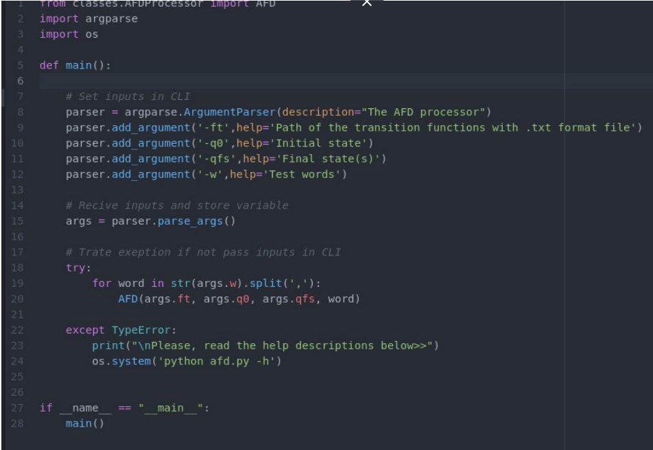

The main code is named afd.py, in which you can run a command in the windows / linux terminal to test several words for different AFDs. Here is the main code below:

This file deals with the entries that are: the folder where the examples are in .txt format (will be explained later on with writing one), the initial state, the final state (s) and a word or a set of them separated by commas. See an example on the command line:

Now, it will be shown how to place an example file of an automaton. This file must be in .txt format and it must be in any folder, as long as it references its path. For better use of the program, place in the examples / folder that is in the uploaded files folder, in this folder you reference it as shown in figure 2. See below an example of an input txt file:

In the function of the previous image, the inputs are the transition function that is transformed into a matrix, the initial state that refers to the line of the matrix in which it is inserted to carry out the transitions, the set of final states and a test word.

First, it is checked whether the letters contained in the word match the machine's alphabet and, after testing it, the operations of the machine's states are performed, each letter of the word is entered in the transition function.

There will be acceptance by the machine when the cycle is finished, all the word symbols are tested and the last state analyzed is equal to the qfs placed at the entrance. However, it will be rejected when a state of the machine reaches an empty transition and still has letters in the word to be processed, also when the cycle is finished and the final state does not match the same inserted in qfs at the entrance.